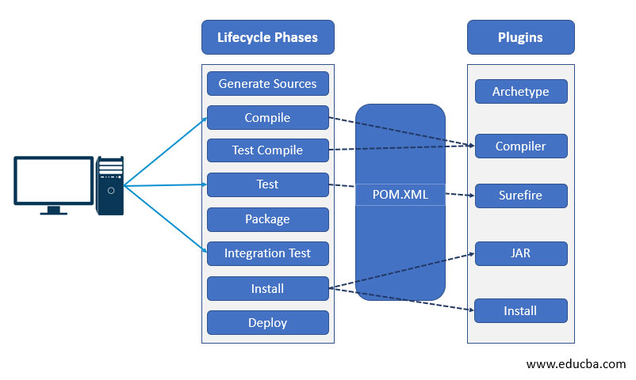
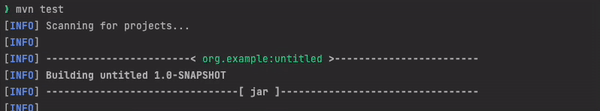
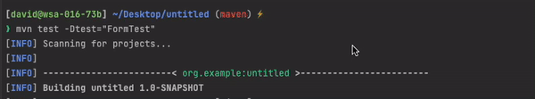
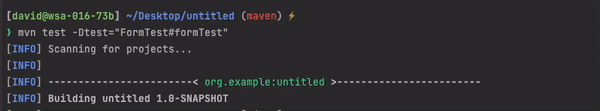

# _-_ *Maven default lifecycle* _-_

## Default lifecycle phases :

- <code>validate</code> — validate the project is correct / necessary information is available
- <code>compile</code> — compile the source code
- <code>test</code> — n/a (tests should not require the code be packaged or deployed)
- <code>package</code> — take the compiled code and package it in its distributable format *.jar*
- <code>verify</code> — run any checks on results of integration tests to ensure quality criteria are met
- <code>install</code> — install the package into the local repository
- <code>deploy</code> — copies the final package to the remote repository for sharing

## Command-line statements to run testing on the project :

<code>mvn test</code> — all tests will be executed

<code>mvn test -Dtest="FormTest"</code> — test methods from FormTest class will be executed

<code>mvn test -Dtest="FormTest#formTest"</code> — specifically *formTest()* test method will be executed 

